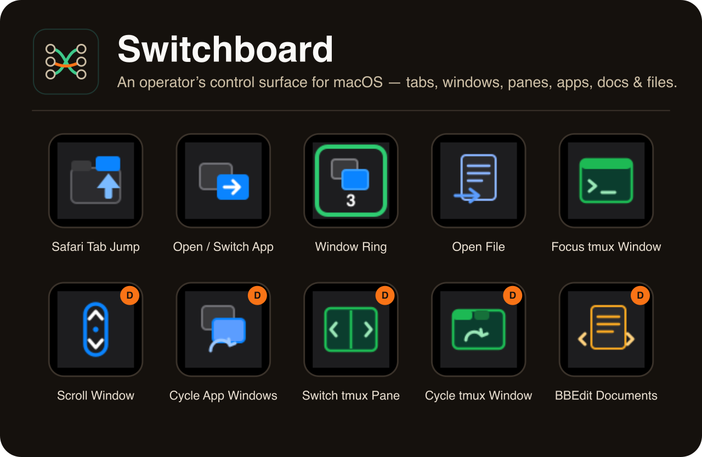

# Switchboard



*An operator's control surface for macOS — routing your attention across tabs, windows, panes, apps, documents, and files from a Stream Deck.*

Ever lose a beat hunting for the right tab or window? Tactile switches beat hunting-and-clicking. Switchboard is a **macOS Stream Deck plugin** for fast context-switching: jump to **Safari** tabs (with multi-account **Gmail**/**Calendar** presets), switch and cycle **app windows**, drive **tmux** windows and panes, move between **iTerm2** windows and **BBEdit** documents, open files by wildcard pattern, and tap through a custom **window ring** — all from Stream Deck keys and dials.

---

## The story

I'm an engineer by training, but these days I work from the director's chair, not the IDE — I advise MedTech and SaaS CEOs on aligning technology with strategy. I didn't *write* Switchboard; I **directed** an AI agent (Claude) to build it: I specified what I wanted, steered the design, reviewed the work, and insisted on tests at every step. That's how a working, tested tool shipped in an afternoon.

That's the point. Switchboard is a **Moving Average Labs** artifact — a small, concrete proof of how AI changes the way operators build. The lesson isn't the tmux dials; it's the operating model behind them.

Read the full story in the flagship essay → [I Directed an AI to Ship Real Software](https://www.movingavg.com/essays/directing-ai-to-ship-real-software.html). Advisory work lives at [movingavg.com](https://movingavg.com).

---

## What it does

Eleven actions, grouped by what they route your attention to.

**Safari**
- **Safari Tab Jump** *(key)* — jump to an open Safari tab, or open it if it isn't there yet. Built-in presets for multi-account Gmail and Google Calendar, plus custom sites and private-window targets. URL matching supports `*` wildcards. Hold the key to capture the current front tab into the button.

**Windows & apps**
- **Open / Switch App** *(key)* — launch or switch to an app, optionally focusing a window whose title matches a pattern. Hold the key to capture the frontmost app into the button.
- **Cycle App Windows** *(dial)* — rotate through the windows of the frontmost application; press or tap the touchscreen to flip the dial into cycling the visible apps themselves.
- **Scroll Window** *(dial)* — rotate to scroll the frontmost window (one proportional scroll-wheel event via a native helper); push to jump to the top (or toggle speed); tap the touchscreen to toggle fast/slow.
- **Arrange Window** *(dial)* — rotate to tile the frontmost window through the active arrangement (halves, thirds, quarters — across columns or rows — or a 2×2/2×3/2×4 grid); counter-clockwise retraces the same arrangement in reverse. Tap the touchscreen to toggle between the button's two configured arrangements (e.g. columns ↔ grid). Push to maximize. Uses a native Accessibility helper that's Dock-aware and multi-monitor correct.
- **Window Ring** *(key)* — a curated ring of windows: long-press to add the current window (or remove it), tap to cycle through them. The key shows a live count with a green ring when the current window is a member; optional sound on long-press.

**tmux & iTerm2**
- **Focus tmux Window** *(key)* — raise the iTerm2 window for a tmux window, optionally switching to it. Hold the key to capture the current tmux window into the button. The key face renders live as a mini tmux pane: its status bar lights up in the session's color — with a block cursor — exactly when that window would receive your keystrokes (active in tmux, focused in iTerm2, iTerm2 frontmost).
- **Switch tmux Pane** *(dial)* — rotate to move between tmux panes — or, after a press/tap toggles the mode, tmux windows. The touchscreen shows the mode and the pane's running command (or the window name).
- **Cycle tmux Window** *(dial)* — rotate to cycle tmux windows; push for the last window. Tap the touchscreen to widen the scope to ALL sessions — rotation then crosses session boundaries and push jumps to the last session. Renders the current session/window live on the touchscreen.

**BBEdit**
- **BBEdit Documents** *(dial)* — move between the open documents in BBEdit's front window, in your chosen order (open order, alphabetical, or by last-modified); push to jump back to the previous document.

**Files**
- **Open File** *(key)* — open the newest, latest-modified, or pattern-matched file in a folder, with your default app / BBEdit / a chosen app, and a live ✓/✗ status badge.

---

## Highlights worth a line

- The **Cycle tmux Window** dial draws dynamic touchscreen graphics — the current session/window renders live on the encoder display.
- **Safari Tab Jump** matches Safari tabs by `*` wildcard, so a tab finds its home even when the URL drifts.
- **Open File** shows a live ✓/✗ status badge right on the key — you can see at a glance whether a matching file exists.
- **Safari Tab Jump** ships multi-account Gmail and Calendar presets — pick the account number, and the URL and match pattern are built for you.
- **Window Ring** flashes a green check on add and a red "−" on remove, with an optional sound, so long-press registration is unmistakable.
- One interaction grammar everywhere: **rotate** browses, **press** escapes to a known place, **tap** flips the dial's mode or scope, and **holding** a go-to key teaches it whatever you're looking at.

---

## Install

Requires macOS 12+ and the Stream Deck app 6.5+. Pick whichever fits you — in
all cases, **quit and relaunch Stream Deck afterwards**, then add Switchboard's
actions to your keys/dials.

### 1. Double-click installer (easiest — no Terminal)

Download **`com.movingavg.switchboard.streamDeckPlugin`** from the
[latest Release](../../releases/latest) and **double-click it**. Stream Deck
installs the plugin for you. Done.

### 2. Homebrew

```bash
brew install --cask windaddict/switchboard/switchboard
```

(Requires the published cask; see [`packaging/homebrew/switchboard.rb`](packaging/homebrew/switchboard.rb).)

### 3. Finder — drag the folder

For folks who'd rather use Finder than the Terminal:

1. Download this repo: green **Code** button → **Download ZIP**, then unzip it.
2. Open Finder and press **⌘⇧G** (Go → Go to Folder). Paste this and press Return:
   ```
   ~/Library/Application Support/com.elgato.StreamDeck/Plugins
   ```
3. From the unzipped repo, **drag the `com.movingavg.switchboard.sdPlugin` folder**
   into that Plugins window.
4. Quit and relaunch Stream Deck.

(The plugin is committed pre-built and self-contained, so the dragged folder
runs as-is — no build step needed.)

### 4. Terminal (developers)

```bash
# Symlink the .sdPlugin folder into the Stream Deck plugins dir
ln -s "$(pwd)/com.movingavg.switchboard.sdPlugin" \
  ~/Library/Application\ Support/com.elgato.StreamDeck/Plugins/

# …or use the Elgato CLI
npx @elgato/cli link
```

Then restart the Stream Deck app.

---

## Permissions

Switchboard sends keystrokes and drives other apps, so macOS asks for two grants on first use:

- **Accessibility** — for keystrokes, scrolling, and window cycling.
  System Settings → Privacy & Security → Accessibility → enable Stream Deck.
- **Automation** — for driving Safari, iTerm2, and BBEdit.
  System Settings → Privacy & Security → Automation → enable Stream Deck for the target apps.

If a grant is denied, the key shows an alert and the plugin log spells out the exact re-enable path instead of failing silently.

---

## Status & license

**Personal project, shared as-is — not supported.** Built for one Mac and published as a proof artifact (see "The story"), not a product. No issue tracker, no roadmap, no guarantees. Use it, fork it, learn from it.

Licensed under the **MIT License** — see [`LICENSE`](LICENSE).

> **Disclaimer of warranty & liability.** Switchboard automates your Mac: it sends keystrokes and scroll events and drives other applications (Safari, iTerm2, BBEdit, Finder, and others) via AppleScript and System Events. THE SOFTWARE IS PROVIDED "AS IS", WITHOUT WARRANTY OF ANY KIND, EXPRESS OR IMPLIED, INCLUDING BUT NOT LIMITED TO THE WARRANTIES OF MERCHANTABILITY, **FITNESS FOR A PARTICULAR PURPOSE**, AND NONINFRINGEMENT. You use it entirely at your own risk; in no event shall the author be liable for any claim, damages, data loss, or other liability arising from the software or its use.

> **Trademarks & affiliation.** Switchboard is an independent, unofficial project. It is **not affiliated with, endorsed by, or sponsored by** Elgato or Corsair Memory, Inc. **Stream Deck** is a trademark of Corsair Memory, Inc., used here only to describe compatibility. Safari is a trademark of Apple Inc.; BBEdit of Bare Bones Software, Inc.; iTerm2 and all other product names, logos, and brands are the property of their respective owners.

---

## Built with

Elgato Stream Deck SDK v2 · TypeScript / Node · 329 passing tests · `streamdeck validate` runs in the build · native helpers are universal (Apple Silicon + Intel), Developer ID signed & notarized.

```bash
npm install
npm run build      # bundles to com.movingavg.switchboard.sdPlugin/bin/plugin.js
npm test           # vitest
npm run typecheck
```

> The plugin UUID is `com.movingavg.switchboard`, matching the public name **Switchboard**. It was renamed from a legacy id; `scripts/rename.sh` performs that migration and rewrites the UUIDs in the Stream Deck profile store so already-configured buttons keep their settings.
