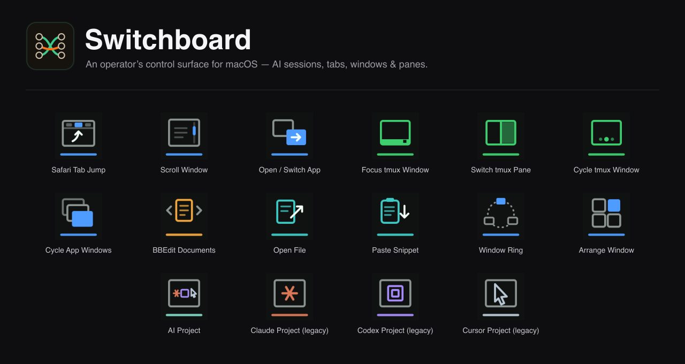
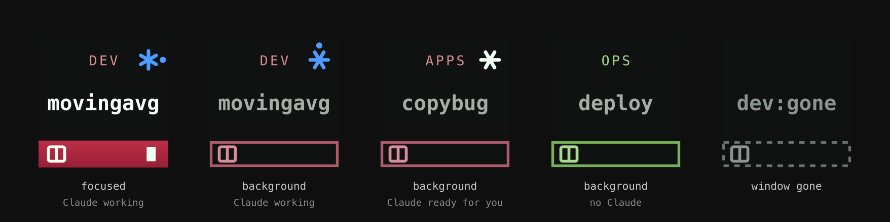
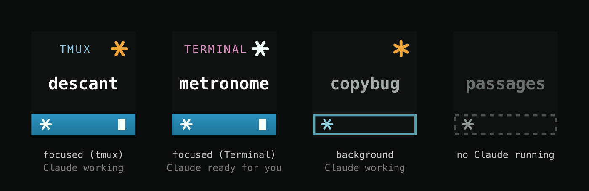
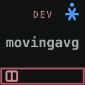
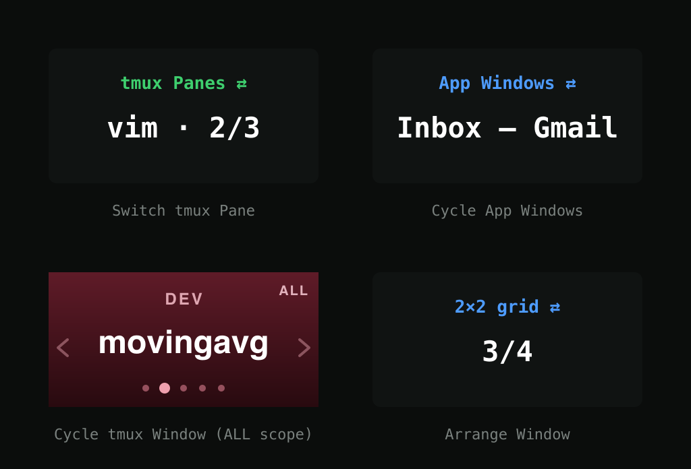

# Switchboard



*An operator's control surface for macOS — routing your attention across terminal coding agents, tabs, windows, panes, apps, documents, and files from a Stream Deck.*

Ever lose a beat hunting for the right tab or window? Tactile switches beat hunting-and-clicking. Switchboard is a **macOS Stream Deck plugin** for fast context-switching: keep an eye on your **Claude Code**, **Codex CLI**, and **Cursor CLI** projects from one key on the deck, see whether each needs you, and press to raise its exact terminal session. Jump to **Safari** tabs (with multi-account **Gmail**/**Calendar** presets), switch and cycle **app windows**, tile and ring **windows**, drive **tmux** windows and panes (raising the right **iTerm2** window as you go), move between **BBEdit** documents, and open files by wildcard pattern — all from Stream Deck keys and dials.

**New:** a single **AI Project** key now follows a **Claude Code**, **Codex CLI**, or **Cursor CLI** session — hold it while the agent's terminal is frontmost and it works out which of the three it is. It replaces the three separate per-agent keys, which still work but are marked *(legacy)* and will be removed in a later release. See [what it does](#what-it-does) for how to move a key over.

**Cursor here means the terminal agent** — the `cursor-agent` command you run in iTerm2 or tmux. Switchboard does not drive the Cursor editor.

---

## The story

I'm an engineer by training, but these days I work from the director's chair, not the IDE — I advise MedTech and SaaS CEOs on aligning technology with strategy. I didn't *write* Switchboard; I **directed** an AI agent (Claude) to build it: I specified what I wanted, steered the design, reviewed the work, and insisted on tests at every step. That's how a working, tested tool shipped in an afternoon — and it has kept evolving, session by session, in the open ever since.

That's the point. Switchboard is a **Moving Average Labs** artifact — a small, concrete proof of how AI changes the way operators build. The lesson isn't the tmux dials; it's the operating model behind them.

Read the full story in the flagship essay → [I Directed an AI to Ship Real Software](https://www.movingavg.com/essays/directing-ai-to-ship-real-software.html). Advisory work lives at [movingavg.com](https://movingavg.com).

---

## What it does

Sixteen actions, grouped by what they route your attention to.

**Coding agents**
- **AI Project** *(key)* — one live face for a **Claude Code**, **Codex CLI**, or **Cursor CLI** (`cursor-agent`, the terminal agent — not the Cursor editor) session. Hold the key for ½ second while the agent's terminal is frontmost and it works out which of the three it is looking at, then takes on that agent's mark: a coral spark for Claude, a violet square for Codex, an arrow for Cursor. Blue with a moving dot means a turn is running, amber means the agent is waiting on *you*, white means the prompt is idle, gray means unknown or ambiguous. A **red stripe down the left edge is an unread mark**: the agent finished a turn while you were looking somewhere else. It clears when pressing the key successfully raises that session, or on the first check that finds you already there; a press that cannot raise the window shows an alert and leaves the mark alone — as does a press that is ignored because another focus key's raise is still in progress, since all of them take turns. The key samples every 2½ seconds, so a turn that starts and finishes inside one gap is never seen running and leaves no mark. Press to raise its terminal and exact tmux pane.

  *Amber is not equally available to all three.* Codex records "waiting for your approval" in its own session log, so it works in any terminal. Claude Code and Cursor write nothing that distinguishes it from ordinary work — the only evidence is the prompt on screen, which the key can read for **tmux-hosted sessions only**; elsewhere those two show a waiting prompt as blue. For Claude that covers two different prompts: a tool approval, and a question awaiting your decision — the question being the one you meet most, since approvals auto-accept under `--permission-mode auto`. Claude's *plan*-approval prompt appears to use the same component and so should behave the same way, but that was inferred, never measured — see the limits below. Codex and Cursor bind to one exact session; Claude Code has no session identifier and binds by project folder, so two Claude sessions in one folder read as ambiguous rather than being guessed between.

<details>
<summary><b>Superseded:</b> the three per-agent keys (Claude Project, Codex Project, Cursor Project)</summary>

These still work and are unchanged, but **AI Project replaces all three** and they will be removed in a future release. To move a key over: add an AI Project action, hold it for ½ second while that agent is frontmost to capture the session, then delete the old key. Their settings screens carry the same note.

**Claude Code**
- **Claude Project** *(key)* — a live face for a Claude Code project, wherever it runs (tmux, plain iTerm2, or Terminal.app): the spark shows working (amber, turning) vs waiting for your input (white, still), the bar lights when your keystrokes would land in that session, and pressing raises the hosting window. Hold to capture the frontmost session's project.

**Codex CLI**
- **Codex Project** *(key)* — a live face for an interactive Codex CLI session in tmux, plain iTerm2, or Terminal.app: blue means working, amber means blocked on your approval/input, white means ready, and gray means unknown or ambiguous. Press to raise its terminal and exact tmux pane; hold to capture the frontmost session.

**Cursor CLI**
- **Cursor Project** *(key)* — a live face for an interactive Cursor CLI (`cursor-agent`) session in tmux, plain iTerm2, or Terminal.app: blue means a turn is running, amber means Cursor is waiting for you to approve a command, white means the prompt is idle, and gray means unknown or ambiguous. Press to raise its terminal and exact tmux pane; hold to capture the frontmost session. (Amber is tmux-only — see below.)

</details>

**Safari**
- **Safari Tab Jump** *(key)* — jump to an open Safari tab, or open it if it isn't there yet. Built-in presets for multi-account Gmail and Google Calendar, plus custom sites and private-window targets. URL matching supports `*` wildcards. Hold the key to capture the current front tab into the button.

**Windows & apps**
- **Open / Switch App** *(key)* — launch or switch to an app, optionally focusing a window whose title matches a pattern. Hold the key to capture the frontmost app into the button.
- **Cycle App Windows** *(dial)* — rotate through the windows of the frontmost application; press or tap the touchscreen to flip the dial into cycling the visible apps themselves.
- **Scroll Window** *(dial)* — rotate to scroll the frontmost window (one proportional scroll-wheel event via a native helper); press to jump to the top (or, if configured, toggle speed); tap the touchscreen to always toggle fast/slow.
- **Arrange Window** *(dial)* — rotate to tile the frontmost window through the active arrangement (halves, thirds, quarters — across columns or rows — or a 2×2/2×3/2×4 grid); counter-clockwise retraces the same arrangement in reverse. Tap the touchscreen to toggle between the button's two configured arrangements (e.g. columns ↔ grid). Press to maximize. Uses a native Accessibility helper that's Dock-aware and multi-monitor correct.
- **Window Ring** *(key)* — a curated ring of windows: long-press to add the current window (or remove it, if it's already in the ring), tap to cycle through them. The key shows a live count with a green ring when the current window is a member; optional sound on long-press.

**tmux & iTerm2**
- **Focus tmux Window** *(key)* — raise the iTerm2 window for a tmux window, optionally switching to it. Hold the key to capture the current tmux window into the button. It saves the window by name when that name is unique in its session. When another window there shares the name (two auto-named `claude` windows, say), it saves tmux's window id (with the tmux server's process id) instead, which follows that one window through renames and renumbering. If that window closes or the tmux server restarts, the key shows the saved id instead of lighting up, and you hold it again to recapture. The settings dropdown offers same-named windows the same way, labelled with their window number. A key captured by an earlier version from a window whose name was shared still points at the first window with that name; hold it again to fix it. The key face renders live as a mini tmux pane: its status bar lights up in the session's color — with a block cursor — exactly when that window would receive your keystrokes (active in tmux, focused in iTerm2, iTerm2 frontmost). A spark in the corner tracks whichever coding agent runs inside the window — **Claude Code, Codex or Cursor**: blue and slowly turning while it works, still and white when it's idle. (Only the AI Project key shows amber for “waiting on you”; it is bound to one exact session and can say whose approval is wanted.)
- **Switch tmux Pane** *(dial)* — rotate to move between tmux panes — or, after a press/tap toggles the mode, tmux windows. Only drives the tmux session in the frontmost macOS window — when iTerm2 isn't frontmost the dial does nothing (never a background terminal) — and the mode survives restarts. The touchscreen shows the mode and the pane's running command (or the window name).
- **Cycle tmux Window** *(dial)* — rotate to cycle tmux windows; press for the last window. Tap the touchscreen to widen the scope to ALL sessions — rotation then crosses session boundaries and press jumps to the last session. Only drives the tmux client in the frontmost macOS window (does nothing when iTerm2 isn't frontmost). Renders the current session/window live on the touchscreen.

**BBEdit**
- **BBEdit Documents** *(dial)* — move between the open documents in BBEdit's front window, in your chosen order (open order, alphabetical, or by last-modified); push to jump back to the previous document.

**Files**
- **Open File** *(key)* — open the newest, latest-modified, or pattern-matched file in a folder, with your default app / BBEdit / a chosen app, and a live ✓/✗ status badge.

**Text**
- **Paste Snippet** *(key)* — the button is the storage. Press writes the stored text into whatever app is frontmost; hold the key (~half a second) to read the current selection into the key instead of typing it into the settings screen. Holding reads the selection directly through macOS's Accessibility API where an app supports that (standard text fields do; iTerm2, Safari and ChatGPT do not) and falls back to ⌘C where it doesn't; pressing always uses ⌘V, because the direct write was measured reporting success while inserting nothing. So pressing always borrows your clipboard and holding usually does — and it **puts it back**: everything on it, every item and every format, is copied aside first and restored afterwards. Exceptions, stated rather than glossed: a clipboard a password manager marked secret is left alone rather than duplicated (so that gesture replaces it, as before); content another app generates on demand, and anything over 64 MiB, isn't saved either; if you copy something mid-gesture your newer copy almost always wins, though macOS offers no atomic swap so a copy landing inside the swap itself can be lost; holding can't prove the copy it sees came from its own ⌘C, so text another app copies in that instant can be stored and then overwritten; after ⌘V there is a short wait before the restore, because nothing reports when the target app has finished reading — an app slower than that wait pastes your old clipboard instead, which is why restoration is a per-key setting you can switch off; and rarely the clipboard can be emptied and the rewrite fail, which alerts on the key. Holding also refuses while macOS reports Secure Input is on, and refuses a copy marked concealed. The key face previews the stored text (tick a box for dots and a character count instead). The stored text is plain, unencrypted, and lives in the Stream Deck profile on this Mac.

**Multi-actions.** Five actions can be steps in a Stream Deck multi-action: Safari Tab Jump, Open / Switch App, Focus tmux Window, Open File and Paste Snippet. The other eleven cannot. The six dials are encoders, and a multi-action takes keys only. A key step gets its press and release as one instant gesture, so hold-to-capture does not exist there, which rules out Window Ring (its members are added only by holding the key) and AI Project and the three superseded agent keys (bound by holding). A step's key face is never drawn, so a live face would be wasted.

---

## Live on the deck

The **Focus tmux Window** and **AI Project** keys render live (as do the three superseded per-agent keys). Each tmux key is a miniature tmux pane whose status bar lights up exactly when that target would receive your keystrokes; its spark shows whether a coding agent in that window is working. AI Project shows one agent session's own state, and both only observe and focus — they never drive the agent itself.

Two honest limits on the amber "waiting on you" state, and they are not the same for all three agents. **Codex** records approval in its own session log, so amber works in any terminal. **Claude Code and Cursor** write nothing that distinguishes it from ordinary work, so it is read from the prompt on screen — which means amber for those two needs **tmux**; in a bare iTerm2 or Terminal window their prompts read as blue. Detection matches deliberately narrow wording, so a release that rewords a prompt makes amber stop appearing rather than start lying — though recognised wording appearing in ordinary scrolled output can still, in principle, read as amber. Claude's *question* prompt is matched by three markers together rather than its wording, because the question itself is free text; the three were measured against Claude's trust, resume and slash-command pickers, none of which carries all of them. Coverage of the *plan-approval* prompt is inferred from the same component being used, not measured — no live plan prompt was captured.







Across every key: **blue means working** (leave it alone), **amber means the agent is waiting on you** (go there now), **white means idle at the prompt**. Red is not a fourth state — it is the AI Project key's unread mark, a stripe layered over whichever state colour the key is already showing. The one exception is the superseded **Claude Project** key, which predates that scheme and still uses amber for *working* — one more reason to move it to AI Project. (Codex Project and Cursor Project already used blue/amber.)

The dial touchscreens speak the same color language — green drives tmux, blue drives macOS windows and apps, amber drives BBEdit — and the ⇄ mark appears exactly where a tap flips the dial's mode:



---

## Highlights worth a line

- The **Cycle tmux Window** dial draws dynamic touchscreen graphics — the current session/window renders live on the encoder display.
- **Safari Tab Jump** matches Safari tabs by `*` wildcard, so a tab finds its home even when the URL drifts.
- **Open File** shows a live ✓/✗ status badge right on the key — you can see at a glance whether a matching file exists.
- **Safari Tab Jump** ships multi-account Gmail and Calendar presets — pick the account number, and the URL and match pattern are built for you.
- **Window Ring** flashes a green check on add and a red "−" on remove, with an optional sound, so long-press registration is unmistakable.
- Every dial flashes the alert on its touchscreen slot when the work a gesture sends to the Mac fails (a native helper, an AppleScript, the terminal probe or a tmux command), usually because of a missing Accessibility or Automation grant, and logs one line saying why. A failure to save the dial's own mode or setting is not reported this way. A tmux dial turned with no tmux in the frontmost iTerm2 window stays silent on purpose: rotating either tmux dial and pushing the window dial send tmux commands and do nothing there, while the pane dial's press or tap and the window dial's tap still flip their own mode.
- A consistent interaction grammar: **rotate** browses, **press** escapes to a known place (or toggles the mode where there's no place to escape to), **tap** flips the dial's mode or scope, and **holding** a go-to key teaches it whatever you're looking at.

---

## Install

Requires macOS 12+ and the Stream Deck app 7.1+ (the plugin runs on Node 24, which Stream Deck downloads on first launch; versions 6.5 to 7.0 are no longer supported; it has been checked live on 7.6 only, and 7.1 to 7.5 support rests on Elgato's manifest schema). Pick whichever fits you — in
all cases, **quit and relaunch Stream Deck afterwards**, then add Switchboard's
actions to your keys/dials.

### 1. Double-click installer (easiest — no Terminal)

Download **`com.movingavg.switchboard.streamDeckPlugin`** from the
[latest Release](../../releases/latest) and **double-click it**. Stream Deck
installs the plugin for you. Done.

### 2. Homebrew

```bash
brew install --cask windaddict/switchboard/switchboard
```

(Requires the published cask; see [`packaging/homebrew/switchboard.rb`](packaging/homebrew/switchboard.rb).)

### 3. Finder — drag the folder

For folks who'd rather use Finder than the Terminal:

1. Download this repo: green **Code** button → **Download ZIP**, then unzip it.
2. Open Finder and press **⌘⇧G** (Go → Go to Folder). Paste this and press Return:
   ```
   ~/Library/Application Support/com.elgato.StreamDeck/Plugins
   ```
3. From the unzipped repo, **drag the `com.movingavg.switchboard.sdPlugin` folder**
   into that Plugins window.
4. Quit and relaunch Stream Deck.

(The plugin is committed pre-built and self-contained, so the dragged folder
runs as-is — no build step needed.)

### 4. Terminal (developers)

```bash
# Symlink the .sdPlugin folder into the Stream Deck plugins dir
ln -s "$(pwd)/com.movingavg.switchboard.sdPlugin" \
  ~/Library/Application\ Support/com.elgato.StreamDeck/Plugins/

# …or use the Elgato CLI
npx @elgato/cli link
```

Then restart the Stream Deck app.

---

## Permissions

Switchboard sends keystrokes and drives other apps, so macOS asks for its grants as you exercise each feature:

- **Accessibility** — for keystrokes, scrolling, window cycling, and window moving/tiling.
  System Settings → Privacy & Security → Accessibility → enable Stream Deck.
- **Automation** — granted per target app (Safari, iTerm2, Terminal, BBEdit) the first time an action drives it.
  System Settings → Privacy & Security → Automation → enable Stream Deck for the target apps.

If a grant is denied, the key shows an alert and the plugin log spells out the exact re-enable path instead of failing silently.

---

## Status & license

**Personal project, shared as-is — not supported.** Built for one Mac and published as a proof artifact (see "The story"), not a product. No issue tracker, no roadmap, no guarantees. Use it, fork it, learn from it.

Licensed under the **MIT License** — see [`LICENSE`](LICENSE).

> **Disclaimer of warranty & liability.** Switchboard automates your Mac: it sends keystrokes and scroll events and drives other applications (Safari, iTerm2, BBEdit, Finder, and others) via AppleScript and System Events. THE SOFTWARE IS PROVIDED "AS IS", WITHOUT WARRANTY OF ANY KIND, EXPRESS OR IMPLIED, INCLUDING BUT NOT LIMITED TO THE WARRANTIES OF MERCHANTABILITY, **FITNESS FOR A PARTICULAR PURPOSE**, AND NONINFRINGEMENT. You use it entirely at your own risk; in no event shall the author be liable for any claim, damages, data loss, or other liability arising from the software or its use.

> **Trademarks & affiliation.** Switchboard is an independent, unofficial project. It is **not affiliated with, endorsed by, or sponsored by** Elgato or Corsair Memory, Inc. **Stream Deck** is a trademark of Corsair Memory, Inc., used here only to describe compatibility. Safari is a trademark of Apple Inc.; BBEdit of Bare Bones Software, Inc.; iTerm2 and all other product names, logos, and brands are the property of their respective owners.

---

## Built with

Elgato Stream Deck SDK v2 · TypeScript / Node · 1041 passing tests · `streamdeck validate` runs in the build · native helpers are universal (Apple Silicon + Intel), Developer ID signed & notarized.

```bash
npm install
npm run build      # bundles to com.movingavg.switchboard.sdPlugin/bin/plugin.js
npm test           # vitest
npm run typecheck
```

> The plugin UUID is `com.movingavg.switchboard`, matching the public name **Switchboard**. It was renamed from a legacy id; `scripts/rename.sh` performs that migration and rewrites the UUIDs in the Stream Deck profile store so already-configured buttons keep their settings.
